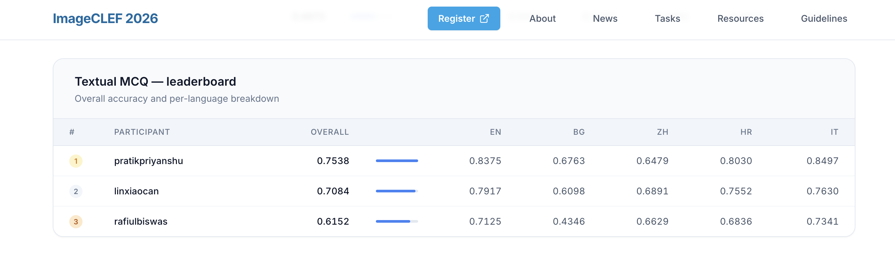
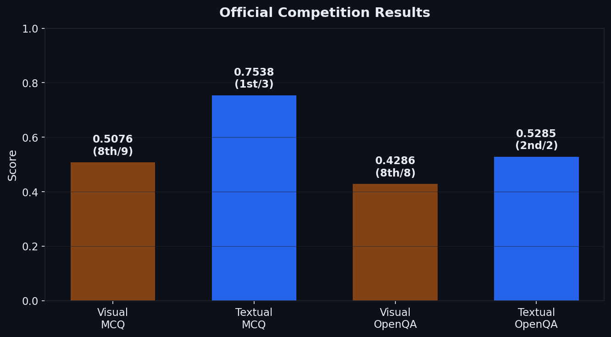
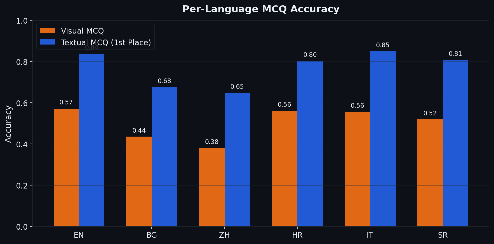
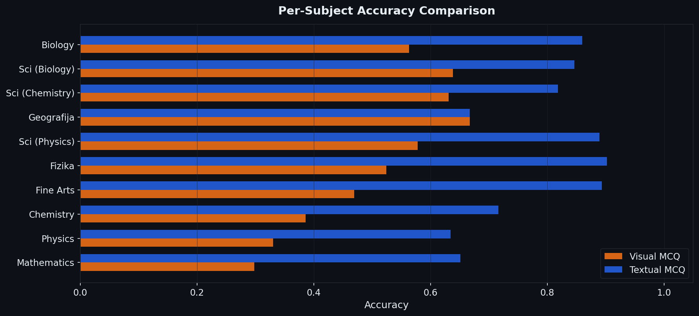
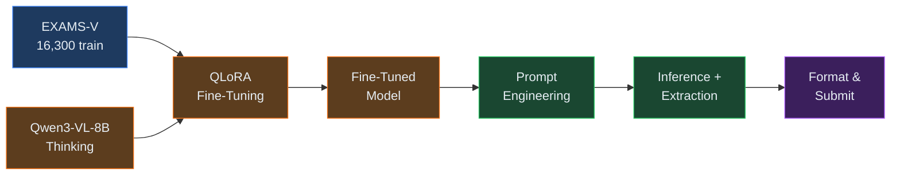

# SRH-ReliableAI at ImageCLEF 2026: Multimodal Reasoning

<p align="center">
  
  
  
  
</p>

<p align="center">
  <strong>Fine-Tuning Thinking Vision-Language Models for Multilingual Exam Question Answering</strong><br>
  <a href="https://mbzuai-nlp.github.io/ImageCLEF-MultimodalReasoning/2026/">Task Page</a> &bull;
  <a href="https://clef2026.clef-initiative.eu/">CLEF 2026</a> &bull;
  <a href="https://ai4media-bench.aimultimedialab.ro/">Leaderboard</a>
</p>

---

## Leaderboard

<p align="center">
  
</p>

<p align="center"><em>Textual MCQ Leaderboard — pratikpriyanshu (SRH-ReliableAI) in 1st place with 0.7538 accuracy</em></p>

---

## Results

<p align="center">
  
</p>

| Track | Type | Metric | Score | Rank |
|:------|:-----|:-------|:-----:|:----:|
| **Textual MCQ** | Multiple-choice (text) | Accuracy | **0.7538** | **1st / 3** |
| **Textual OpenQA** | Open-ended (text) | COMET | **0.5285** | **2nd / 2** |
| Visual MCQ | Multiple-choice (visual) | Accuracy | 0.5076 | 8th / 9 |
| Visual OpenQA | Open-ended (visual) | COMET | 0.4286 | 8th / 8 |

---

## Per-Language Analysis

<p align="center">
  
</p>

Our system leads on **4 of 5 languages** in Textual MCQ (EN, BG, HR, IT), with the strongest performance on Italian (0.850) and English (0.838). The consistent gap between textual and visual tracks across all languages reveals that the model's thinking-mode reasoning excels at linguistic analysis but struggles with spatial/diagrammatic understanding.

---

## Per-Subject Analysis

<p align="center">
  
</p>

The textual-visual accuracy gap is **universal across subjects**. Physics (33% vs 63%) and Chemistry (39% vs 72%) show the largest drops on visual questions, as these subjects require interpreting diagrams, graphs, and chemical structures. Mathematics is the hardest subject on both tracks.

---

## Approach

We use **Qwen3-VL-8B-Thinking** (8B parameters, Normal category), a vision-language model with native chain-of-thought reasoning via `<think>...</think>` tokens, fine-tuned with **QLoRA** on the EXAMS-V training set.



### Key Components

| Component | Description |
|:----------|:------------|
| **QLoRA Fine-Tuning** | 4-bit NF4 quantization, LoRA rank 32, alpha 64, 3 epochs on 16,300 EXAMS-V samples (~9h on H200) |
| **Subject-Aware Prompting** | Prepends *"You are an expert in {subject}."* using metadata (32 categories) |
| **Language-Matched Instructions** | Answer instructions translated into the question's language (6 languages) |
| **Thinking-Mode Extraction** | Multi-stage pipeline to extract A--E answers from `<think>` reasoning outputs |
| **Self-Consistency** | k=3 majority voting with temperature sampling (implemented, not deployed due to cost) |

### QLoRA Configuration

| Setting | Value |
|:--------|:------|
| Base model | `Qwen/Qwen3-VL-8B-Thinking` |
| Quantization | NF4 (4-bit), double quantization |
| Compute dtype | bfloat16 |
| LoRA rank / alpha | 32 / 64 |
| LoRA dropout | 0.05 |
| Target modules | All linear layers |
| Epochs | 3 |
| Batch size | 1 (gradient accumulation: 8) |
| Learning rate | 2e-4 (cosine + warmup 0.1) |
| Max sequence length | 2048 |
| Training time | ~9 hours on NVIDIA H200 |

---

## Key Findings

- **Answer extraction is critical for thinking VLMs**: Naive extraction from `<think>` outputs yields ~25% accuracy; our multi-stage pipeline achieves ~60% zero-shot -- a 35pp improvement from extraction alone.

- **E-bias in Visual MCQ**: The model predicts option E 164 times, but zero gold answers are E in the Visual test set, revealing a systematic fallback issue in the extraction pipeline on visual questions.

- **Mathematics is universally hard**: Lowest accuracy on both tracks (29.8% visual, 65.1% textual), suggesting symbolic reasoning remains challenging regardless of input modality.

---

## Repository Structure

```
.
├── README.md
├── requirements.txt                 # Python dependencies
├── LICENSE
├── PLAN.md                          # Development plan and GPU budget
│
├── src/
│   ├── download_data.py             # Download datasets from HuggingFace
│   ├── prepare_finetune_data.py     # Convert EXAMS-V to training format
│   ├── baseline.py                  # Zero-shot evaluation via vLLM
│   ├── self_consistency.py          # k-ensemble majority voting
│   ├── format_submission.py         # Format predictions to submission JSON
│   ├── error_analysis.py            # Post-hoc error analysis with gold labels
│   └── export_gold_labels.py        # Export gold labels from DataLab
│
├── notebooks/
│   ├── imageclef_pipeline.ipynb     # Full experimental pipeline (10 sections)
│   └── submit_pipeline.ipynb        # Streamlined submission pipeline
│
├── scripts/
│   ├── run_all.sh                   # Automated setup + baseline
│   └── inference.sh                 # A40 inference script (organizer format)
│
├── paper/
│   ├── main.tex                     # Working notes paper (CEUR-WS)
│   ├── references.bib               # Bibliography
│   └── ceurart.cls                  # CEUR-WS LaTeX class
│
└── figures/                         # Generated charts and leaderboard screenshot
```

---

## Reproducing Results

### Prerequisites

- Python 3.10+
- NVIDIA GPU with >= 40 GB VRAM (A40 for inference, H200 for training)
- HuggingFace account with access to gated datasets

### 1. Setup

```bash
pip install -r requirements.txt
huggingface-cli login
```

### 2. Download Data

```bash
python src/download_data.py --data_dir ./data
```

Downloads EXAMS-V (16,300 train / 4,650 val) and all 4 competition test sets.

### 3. Fine-Tuning

```bash
jupyter notebook notebooks/imageclef_pipeline.ipynb
```

Or automated: `bash scripts/run_all.sh`

### 4. Inference & Submission

```bash
jupyter notebook notebooks/submit_pipeline.ipynb
```

### 5. Post-Hoc Error Analysis

```bash
python src/error_analysis.py \
    --gold_dir gold_and_preds \
    --visual_preds gold_and_preds/mcq_visual_preds.json \
    --textual_preds gold_and_preds/mcq_textual_preds.json \
    --latex
```

---

## Task Overview

The [ImageCLEF 2026 Multimodal Reasoning](https://mbzuai-nlp.github.io/ImageCLEF-MultimodalReasoning/2026/) task evaluates systems on answering multilingual exam questions across 4 tracks (Visual/Textual MCQ and OpenQA), spanning **6 languages** (EN, BG, ZH, HR, IT, SR) and **32 academic subjects**. Part of the broader [ImageCLEF 2026](https://clef2026.clef-initiative.eu/) evaluation campaign at [CLEF 2026](https://clef2026.clef-initiative.eu/), Jena, Germany.

**Datasets:**
- Training: [EXAMS-V](https://aclanthology.org/2024.acl-long.420/) (ACL 2024)
- Model: [Qwen3-VL-8B-Thinking](https://huggingface.co/Qwen/Qwen3-VL-8B-Thinking) (publicly available)
- Platform: [AI4Media-Bench](https://ai4media-bench.aimultimedialab.ro/)

---

## Hardware

| Phase | GPU | Time |
|:------|:----|:-----|
| Data download + setup | CPU | ~1h |
| Prompt engineering (500-sample val) | H200 | ~2h |
| QLoRA fine-tuning (8B) | H200 (150 GB) | ~9h |
| MCQ test inference (2,770 samples) | H200 | ~9h |
| OpenQA test inference (863 samples) | H200 | ~2h |
| **Total** | | **~23h** |

---

## Citation

```bibtex
@inproceedings{priyanshu2026imageclef,
  title     = {{SRH-ReliableAI} at {ImageCLEF} 2026 Task on Multimodal Reasoning:
               Fine-Tuning Thinking Vision-Language Models for Multilingual
               Exam Question Answering},
  author    = {Priyanshu, Pratik},
  booktitle = {CLEF 2026 Working Notes},
  series    = {CEUR Workshop Proceedings},
  year      = {2026},
  address   = {Jena, Germany},
  publisher = {CEUR-WS.org},
}
```

---

## License

This project is released under the [MIT License](LICENSE).
